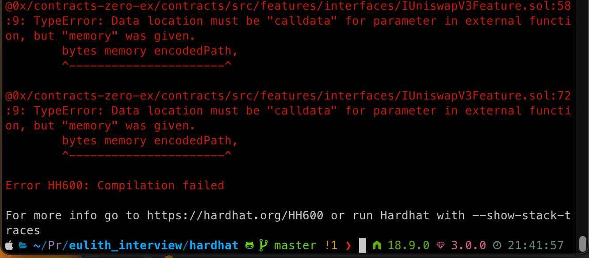

### Journey Thus Far
1. I started the project (you can see the commits) by setting up a local ETH chain using **geth**. 
2. After initial setup, I created [scripts](https://github.com/kensj/0x_protocol_dummy/tree/87ce4d350e034cfe064f832ad99ecea12f59b790/scripts) to help me set up the genesis block & the accounts.
3. I briefly explored [truffle](https://www.npmjs.com/package/truffle) to compile smart contracts but moved away from it for a few reasons.
   - It is designed for Ethereum (not future-proof for other chains)
   - It offered too much additional complexity for simply needing ABI & Bytecode for the contracts
4. I started setting up the Rust codebase & installed the necessary packages. At this point I realized a few things:
   - Rust crate ethers provides [Ganache](https://docs.rs/ethers/latest/ethers/utils/struct.Ganache.html) which seems to make local chain development easy
   - I opted to stay away from having to manage my local chain for now in favor of using Ganache (you can see I removed the files, but you can see it in the commit history)
5. After attempting to compile the 0x smart contracts in Rust, it seemed less trivial than I initially imagined.
6. I started using [Hardhat](https://hardhat.org/) to attempt to compile the contracts, but have faced some issues.
    - 
7. The goal/hypothesis from where I am at the moment:
    - Successfully compile the contracts via Hardhat & make any necessary modifications to the contract
    - Use the ABI & Bytecode in Rust to deploy the contract to the chain (I could have also done this with Truffle if I was using my local chain, but I did want to continue using Rust)
    - Then with [Rust](https://docs.rs/ethers-contract/0.2.2/ethers_contract/struct.Contract.html#example), call the transformERC20 function

### Lingering Questions
1. I'm unsure if my code for the smart contract is correct. I imagine that with the interface I would have to add some data to have it be compliant with what would be expected.
2. I noticed that the 0x protocol is using an outdated version of solidity (I wish there was an easy Solidity Version Manager). It seems to me that this is by design. 
3. I thought about deploying the [TransformERC20Feature](https://github.com/0xProject/protocol/blob/b040e55202bf99654e8e20d7729934dd10507b56/contracts/zero-ex/contracts/src/features/TransformERC20Feature.sol#L41), but I imagine that we want to be able to use all the features of the 0x protocol.
4. I have a testing strategy in mind but for now, I'm keeping all Rust code in the main function for implementation purposes.

**Total Hours So Far:** 6 hours. I took some time off in between because I had to catch up with other work & hop into some calls.